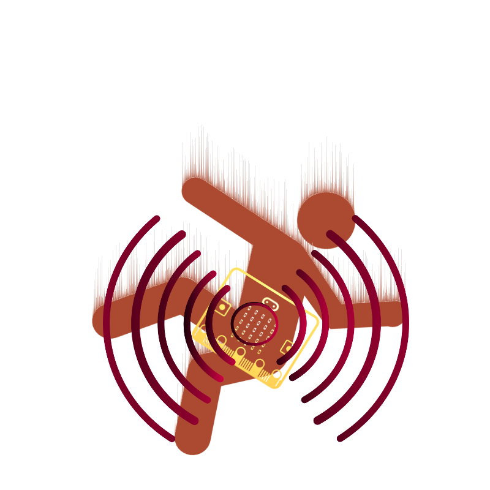
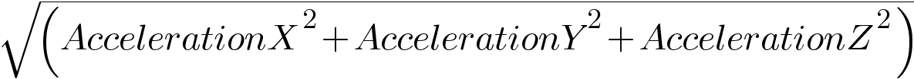
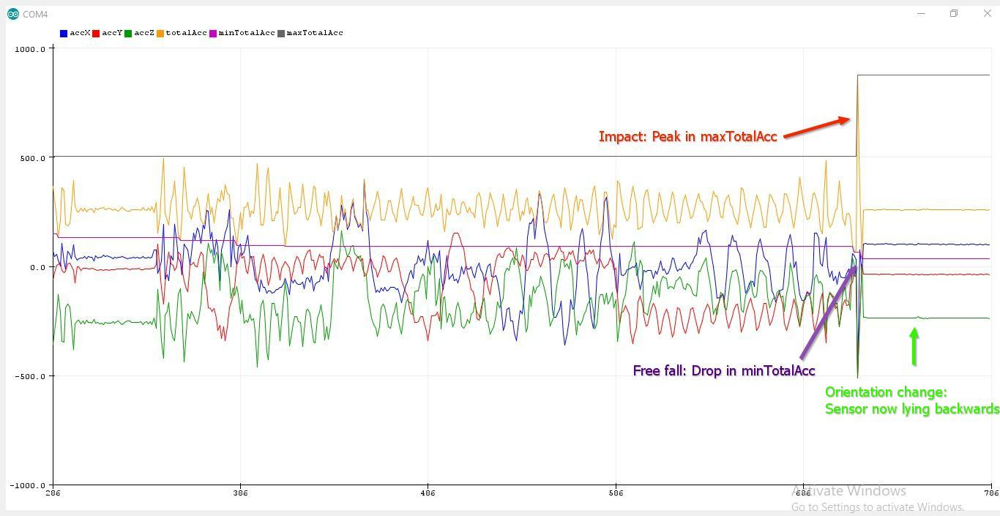
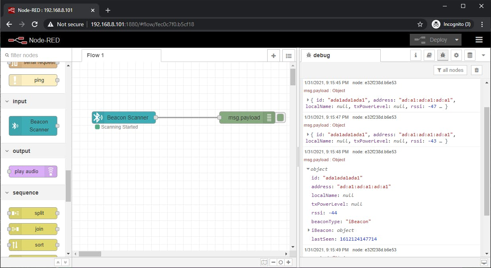
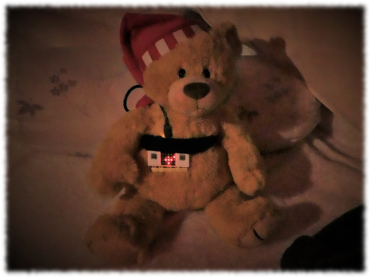

# FallDetectionAndAlert-Microbit-Ada
FallDetectionAndAlert-Microbit-Ada - A PoC for a simple fall detection and alert system featuring the BBC micro:bit board and the Ada programming language.

This is just a PoC and fun project to learn Ada on the BBC micro:bit.

Story
=====

Introduction
------------

For people, especially elderly people, experiencing a fall unnoticed by
others can have severe health consequences. Besides the obvious
possibility of injuries as direct result of the impact, further health
damage is often the consequence if medical aid and treatment cannot be
obtained within a short time. The accident situation gets aggravated, if
the person is no longer able to call for help due to immobility or
unconsciousness. A lot of research has been done and many articles have
been published on the topic of building devices for fall detection using
accelerometers. This project makes use of some of this knowledge to
implement a very simple solution as a proof of concept featuring the BBC
micro:bit board and the Ada programming language.

Components & Software
---------------------

### BBC micro:bit

The micro:bit is an open source hardware ARM-based embedded system
designed by the BBC for use in computer education. The board is fitted
with a Nordic nRF51 Bluetooth enabled 32-bit ARM microcontroller,
accelerometer and magnetometer sensors, USB connectivity, a display
consisting of 25 LEDs, two programmable buttons, and can be powered by
either USB or an external battery pack. Device inputs and outputs are
through five ring connectors that form part of a larger 25-pin edge
connector.

See [https://microbit.org/](https://microbit.org/) for more details.

### GNAT

GNAT is a free-software compiler for the Ada programming language which
forms part of the GNU Compiler Collection (GCC). It supports all
versions of the language, i.e. Ada 2012, Ada 2005, Ada 95 and Ada 83 and
is now maintained by AdaCore Technologies.

See <https://www.adacore.com/> for more details.

Fall detection & alerting
-------------------------

The idea for this project is, to use the accelerometer sensor of the
micro:bit, to detect a fall situation and to alert a monitoring system
via Bluetooth.

It is assumed that the micro:bit is part of a device (micro:bit board,
battery and casing) that can be worn e.g. clipped to a belt of person.

The fall detection algorithm focuses on the total acceleration – the
"sum" of the acceleration of 3 axes – defined as as
.

It is based on the concept that during a fall, a person experiences a
momentary freefall – a reduction in acceleration toward zero, followed
by a large spike in acceleration on the impact and a sudden change in
orientation (e.g., from standing to lying) – all this within a time
interval of one second or less.

_Serial plot of a drop test with the micro:bit ..._

If all this status changes (free fall, impact, orientation change) in
acceleration are measured within a short time interval, it is assumed
that the device (and its user) has been fallen down and a BLE iBeacon
packet will be sent in short intervals until help arrives or the user is
able to reset the alert by pressing a button, therefore indicating, that
he/she needs no assistance.

To prevent or stop false alarms a buzzer can be connected to the
micro:bit, to alert the user, if the fall detection has been triggered.
In case of a false alarm the user can react and reset the alarm by
pressing a button.

A monitoring system (e.g., based on a Raspberry Pi (or multiple ones)
running Node-RED) can be used to continuously scan for a specific beacon
ID and trigger an alert on its detection. Multiple “strategically
placed” scanning devices can be used to determine a rough localization
based on the RSSI of the received beacon packets.

_Node-RED on a Raspberry Pi - Scanning for the micro:bit's iBeacon packet ..._

About code
----------

For getting started with programming Ada for the micro:bit the blog
articles written by Fabien Chouteau are the first choice for reading:

Ada for micro:bit Part 1: Getting Started
at <https://blog.adacore.com/ada-for-microbit-part-1-getting-started>

Follow these instructions (and optionally the other 6 parts of the
series) to setup a working development environment for programming Ada
for the micro:bit.

Especially of interest for this project is the article

Ada for micro:bit Part 7: Accelerometer
at [https://blog.adacore.com/ada-for-microbit-part-7-accelerometer.](https://blog.adacore.com/ada-for-microbit-part-7-accelerometer)

“Unfortunately” the micro:bit that was available for this project was a
revision 1.5 board, which features a new combined accelerometer &
magnetometer motion sensor, the LSM303AGR eCompass module by ST
([https://www.st.com/en/mems-and-sensors/lsm303agr.html)](https://www.st.com/en/mems-and-sensors/lsm303agr.html).
Since the package Microbit.Accelerometer of AdaCore's Ada Driver Library
is fixed on the MMA8653, this package could not be used directly.
Fortunately
a [driver ](https://github.com/AdaCore/Ada_Drivers_Library/tree/master/components/src/motion/lsm303agr)for
the LSM303AGR has been added to the library last month, which could be
used to interface the accelerometer on a micro:bit rev. 1.5.

The code is very simple and self explanatory. The
package ThreeAxisAccelerometer encapsulates the LSM303AGR driver similar
to the Microbit.Accelerometer package and adds the calculation of the
total acceleration. The fall detection algorithm itself is provided by
the package AccelerationState.

To Do
-----

-   More configurable code (beacon UUID etc.), calibration features ...
-   Encasing with batteries, appropriate buttons, buzzer and belt
    clip ...
-   Scanning infrastructure ...
-   ...

Learnings
---------

-   Learning to program in Ada in about 24 hours can be fun ...
    sometimes ... sometimes not ... ;)
-   If you make drop tests with your development board, think about
    using a cushion as drop zone from the beginning or you might have to
    resolder some parts like buttons, connectors etc. :( or ..
-   Use a teddy bear as test subject (still consider the cushion) ... ;)

_Unhappy test subject ... ;)_
